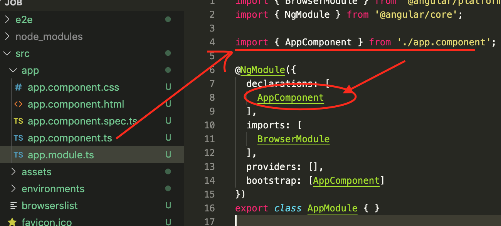
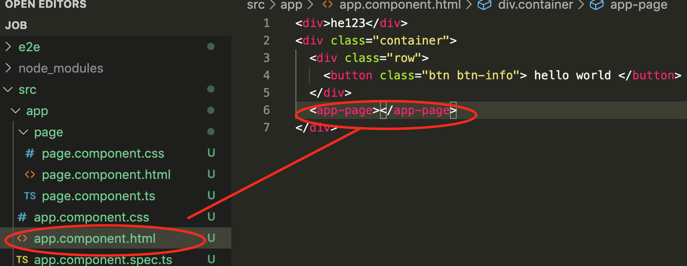
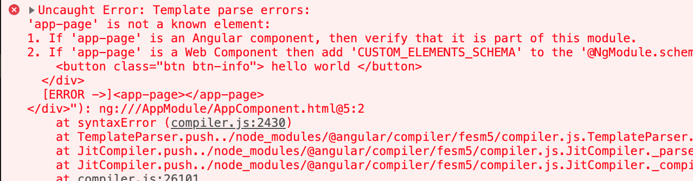
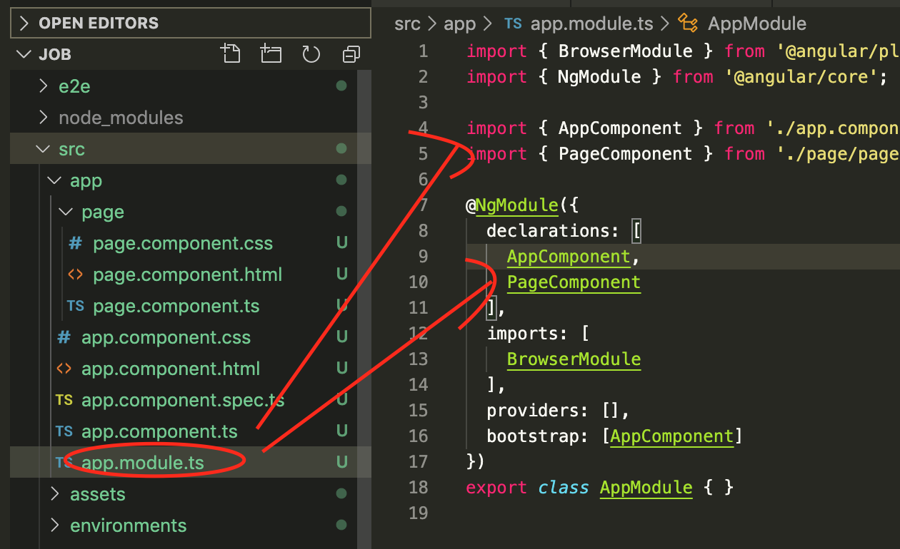
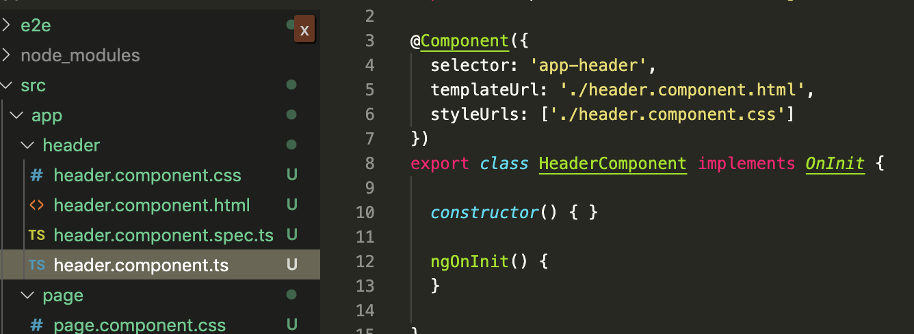
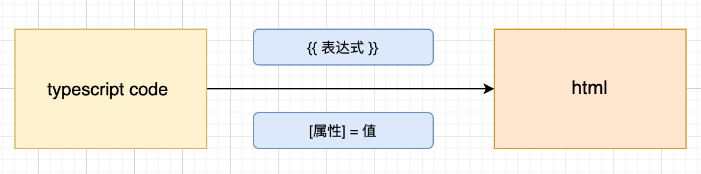
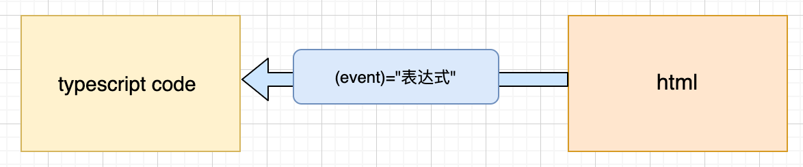

# angular tutorial  / angular 教程

## 2，基础

(1) 组件 component

> 在说component之前，需要明白一件事情： angular中component不能独立存在，**组件必须生存在一个module里**
> 也就是说不存在独立的component，当你写好了一个组件，发现他没被任何一个module声明的话，是无法使用的

<1>  默认组件

通过命令 ng new project 创建的项目，默认会有一个welcome页面，这个页面只有一个组件**app.component**依附于一个module: **app.module**

一个组件，约定的命名规则是 \<name\>.component.<后缀>

一般一个组件的组成按照分层解耦的原则包含三个文件，分别是：

  1. 处理逻辑和交互的 \<name\>.component.ts 文件
  2. 处理布局和文档的 \<name\>.compoennt.html文件
  3. 处理样式和表现层 \<name\>.component.css 文件 ，也可能是less

<2> 模仿app.component，手动创建一个page.component 

创建三个文件，然后打开page.component.ts编辑， 把app.component.ts 里面内容copy过来修改如下

然后需要把这个组件的标签，放到app.component.html 去显示，结果什么也没显示出来,还报错了

报错的原因是，angular不认识这个组件，不知道怎么渲染。  我们之前说过，component必须生存在一个module里

打开app.module.ts,添加如下两处：

**注意：**，报错后，需要重启服务，ng server 查看页面就显示出来了。

<3> 使用命令, ng generate component <name>  自动创建一个component。

    ng generate component header

或者缩写：

    ng g c header

会自动在app文件夹下(app  module) 下创建一个header文件夹和四个文件(多出来一个测试用例文件)， 并且自动的把这个component声明到app.module里面

你只需要使用即可，很方便

-----

(2) 数据绑定

> angular8中有三种数据绑定

<1> 从ts到html的单向数据绑定

>当数据层面的东西发生变化之后，影响到html上数据的显示。 通过{{}}形式绑定数据或者通过属性[property]形式绑定数据显示到html中

举例： page中的greet属性，显示到页面上

<2> 页面发生交互，如点击事件，form表单的输入事件，影响到了数据层面的变化。 html到model层面。

主要使用事件绑定 （event）= "表达式";

<3> 双向绑定

> 可以看到表现形式结合 1 和 2  [(ngModel)],即一个[]一个（）号来实现绑定

(3) 指令