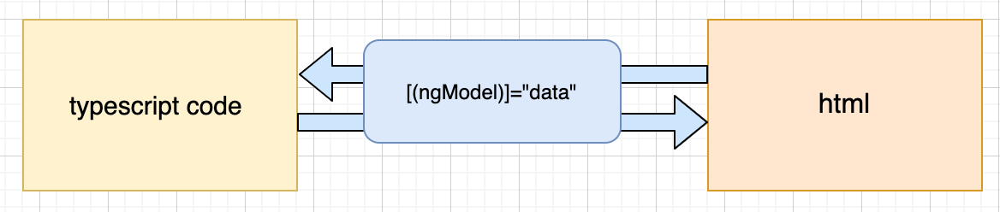

# angular tutorial  / angular 教程

## 2，基础

(1) 组件 component

> 在说component之前，需要明白一件事情： angular中component不能独立存在，**组件必须生存在一个module里**
> 也就是说不存在独立的component，当你写好了一个组件，发现他没被任何一个module声明的话，是无法使用的

<1>  默认组件

通过命令 ng new project 创建的项目，默认会有一个welcome页面，这个页面只有一个组件**app.component**依附于一个module: **app.module**

一个组件，约定的命名规则是 \<name\>.component.<后缀>

一般一个组件的组成按照分层解耦的原则包含三个文件，分别是：

  1. 处理逻辑和交互的 \<name\>.component.ts 文件
  2. 处理布局和文档的 \<name\>.compoennt.html文件
  3. 处理样式和表现层 \<name\>.component.css 文件 ，也可能是less

<2> 模仿app.component，手动创建一个page.component 

创建三个文件，然后打开page.component.ts编辑， 把app.component.ts 里面内容copy过来修改如下

然后需要把这个组件的标签，放到app.component.html 去显示，结果什么也没显示出来,还报错了

报错的原因是，angular不认识这个组件，不知道怎么渲染。  我们之前说过，component必须生存在一个module里

打开app.module.ts,添加如下两处：

**注意：**，报错后，需要重启服务，ng server 查看页面就显示出来了。

<3> 使用命令, ng generate component <name>  自动创建一个component。

    ng generate component header

或者缩写：

    ng g c header

会自动在app文件夹下(app  module) 下创建一个header文件夹和四个文件(多出来一个测试用例文件)， 并且自动的把这个component声明到app.module里面

你只需要使用即可，很方便

-----

(2) 数据绑定

> angular8中有三种数据绑定

<1> 从ts到html的单向数据绑定

>当数据层面的东西发生变化之后，影响到html上数据的显示。 通过{{}}形式绑定数据或者通过属性[property]形式绑定数据显示到html中

举例： job项目中，我们要创建一个一个header 和 page，并构建几个侧边栏。 header区域我们要写两个内容，title：页面的标石。  home： 主页的链接。  这两个文字都是定义在ts里面的变量，那么怎么把这两个变量显示出来呢

ts文件

    export class HeaderComponent implements OnInit {

      title="Hello"; //定义变量title，网站的标石
      home="Home";   //定义主页文字
      constructor() { }

      ngOnInit() {
      }

    }

html文件

    

      {{title}}
      
    

第一种方式 : {{ title  }}  通过 {{}} 双花括号绑定

第二种方式:  [innerText] 通过html的属性，类似于angularjs里面的ng-bind

-----

<2> 页面发生交互，如点击事件，form表单的输入事件，影响到了数据层面的变化。 html到model层面。

主要使用事件绑定 （event）= "表达式";

html文件

    <section class="content"> 
      <button (click)="doclick()">click me</button>
    </section>
  
  (click)="doclick()"  通过事件调用了ts中定义的一个函数doclick，函数内定义的东西当然也可以用来赋值更新数据

<3> 双向绑定

> 可以看到表现形式结合 1 和 2  [(ngModel)],即一个[]一个（）号来实现绑定

举例： 

html文件

      

        输入任意字符，查看console单向输出
        <input type="text" (input)="typing($event)">

        输入内容查看数据的双向改变
        <input type="text" [(ngModel)]="info">
        
{{info}}

      

ts文件

      export class ContentComponent implements OnInit {

        constructor() { }

        ngOnInit() {
        }

        doclick(){
          alert(123);
        }

        typing(evt:InputEvent){ //对应上面html中(type)="typing()"
          console.log(evt.target.value);// evt.target 是input的dom对象，value即是他的值
        }

      }

> 直接使用 ngModel会报错，类似如下

Uncaught Error: Template parse errors:
Can't bind to 'ngModel' since it isn't a known property of 'input'. ("

> 原因是，ngModel 是一个特殊指令，为了激活这个指令你需要import “FormsModule” 到appModel中，要不然不识别

----

(3) 指令: 这里介绍angular提供的原生指令

structure directive: 结构指令，意思是会改变DOM结构的指令; 前面要加*

    *ngIf
  
举例：

    

        <button (click)="toggle()">toggle显示隐藏</button>
        
这里是显示的内容

    

  *ngIf---else localreference

    

      当showme = 1 显示 这段文字
    

    <ng-template #localelse> 
      
当showme!=1 时显示这里的描述

    </ng-template>

添加inline样式的指令

  ngStyle  

举例：（注意不加‘’ 写法的不同）

    

    

    

    
 

添加class样式的指令

    ngClass

举例：

    .showBlue {
        display: block;
        width: 400px;
        height: 30px;
        background-color: red;
    }

        <section>
          
使用ngClass

          

  
        </section>

循环输出列表的结构指令 ngFor

    *ngFor

举例：

      <ul>
        <li *ngFor="let item of users;let i = index"  [ngClass]="{'showBlue': i%2 == 0}">
          {{item.id}}
          
        </li>
      </ul>

-----

## [>  component组件](./3.component_组件.md)
