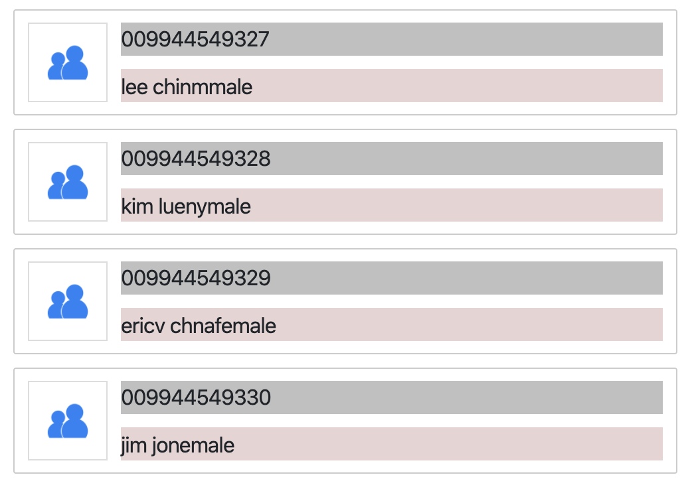
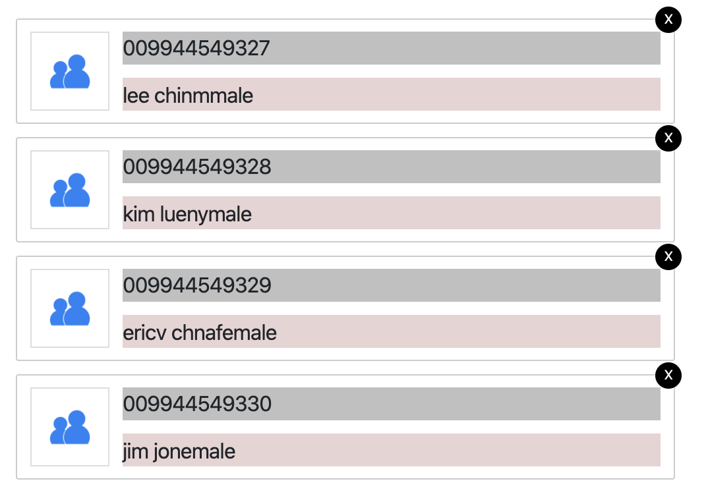
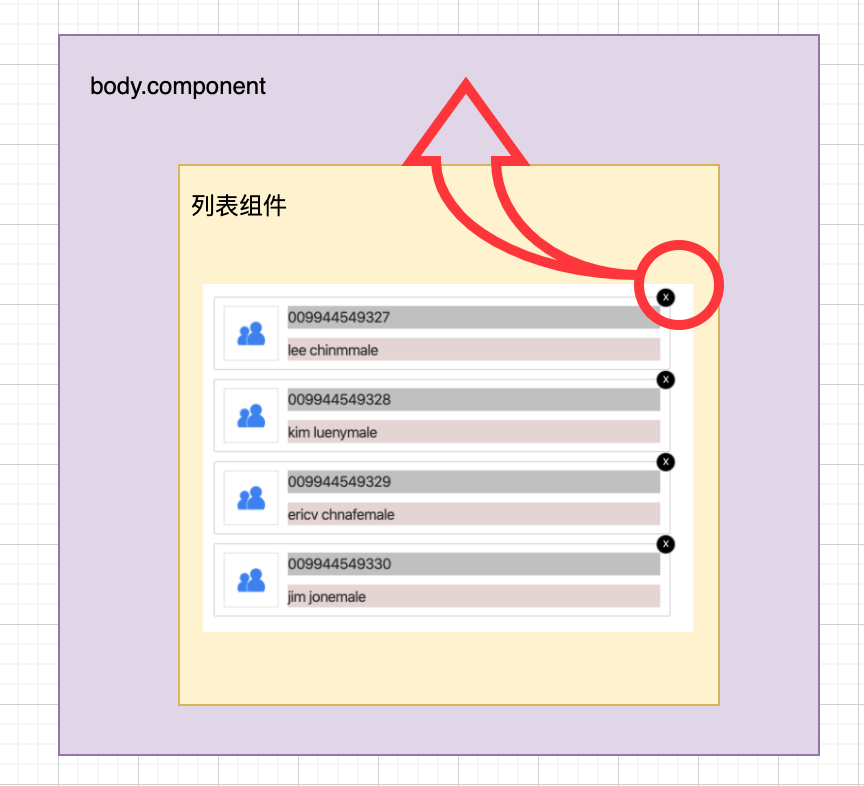
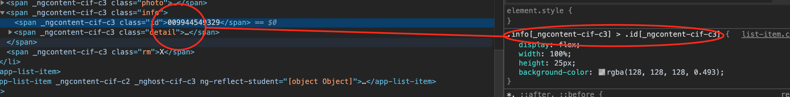
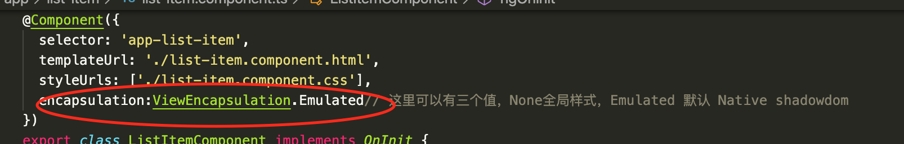

# angular tutorial  / angular 教程

## 3，组件

angular8 创建组件的过程分为命令方式

    ng generate component <组件名>

或者

    ng g c  <组件名>

会默认在app.module下创建组件，并声明到app.module中去； 当然你也可以直接手动创建文件夹-> 创建三个文件->声明到module中

当然你也可以指定module

    ng g c module目录/<组件名>  --module <module名>

### 这一节主要讲，当你创建了一个组件，如何对其进行各种操作和监听

解释： 假设我们创建了一个组件叫app-com的组件，对应的tag应该是<app-com><app-com>，我们如果在这个dom上进行【属性】绑定数据，如果监听这个dom的事件。 因为原生的dom不存在这个东西，你无法监听(click)这些东西，还有就是，这个dom内部可能还存在其他的封装的dom，如何把数据通过<app-com><app-com> 传进去，赋值。

（1） 假设你要建立这么一个列表

我们用ul，但是内部的项目比较复杂，我们把里面的每一条item封装成了一个组件

\<app-list-item\>\</app-list-item\>  对应的内部dom结构如下：

    <li class="list-item">
    
        
    
    
        {{student.id}}
        
        {{student.name}}
        {{student.gender}}
        
    
    </li>

数据如下：

      users = [
        {
        id:"009944549327",
        name:"lee chinm",
        gender:"male",
        photo:"../assets/login.jpg"
        },
        {
        id:"009944549328",
        name:"kim lueny",
        gender:"male",
        photo:"../assets/login.jpg"
        },
        {
        id:"009944549329",
        name:"ericv chna",
        gender:"female",
        photo:"../assets/login.jpg"
        },
        {
        id:"009944549330",
        name:"jim jone",
        gender:"male",
        photo:"../assets/login.jpg"
        }        
    ]

数据的传入

    <app-list-item *ngFor="let user of users; let i = index" [student]="user"></app-list-item>

这里通过一个属性[student] 把对象user 传入进去了，但是这个student在那定义的呢

在app-list-item组件的ts文件中

    @Component({
        selector: 'app-list-item',
        templateUrl: './list-item.component.html',
        styleUrls: ['./list-item.component.css']
        })
        export class ListItemComponent implements OnInit {

        //定义组件的输入属性，数据结构如下
        @Input() student:{id:string,name:string,photo:string,gender:string};

        constructor() { }

        ngOnInit() {
        }

    }

定义之后，dom上就可以通过[student]来使用了，当然也可以设置alias别名

    @Input('abc') student:{id:string,name:string,photo:string,gender:string};

设置别名之后，dom上就只能

    <app-list-item *ngFor="let user of users; let i = index" [abc]="user"></app-list-item>

----

我们在上面列表的基础上添加一个特性，如图下：多了一个删除按钮，我们希望点击x的时候，删除这条数据，更新列表

这里我们先要看一下关系，如图：三个组件，1 body组件，2list组件，3list-item组件

当list-item被点击时，我们希望冒泡出来一个事件告诉list 或者 body我们删除了那个项目(id)，body或者list里面存储数据的地方，根据这个id，遍历数组，删除数组

首先我们在list-item上监听click事件，并抛出事件

        <li class="list-item">
        
            
        
        
            {{student.id}}
            
            {{student.name}}
            {{student.gender}}
            
        
        X  <!--注意这里的click事件-->
        </li>

 代码内部要抛出这个事件

    export class ListItemComponent implements OnInit {

        @Input() student:{id:string,name:string,photo:string,gender:string};

        @Output() removeItem = new EventEmitter<{id:string}>();//定义了一个输出属性

        constructor() { }

        ngOnInit() {
        }
        //点击删除按钮后，执行线面事件，抛出事件给上层组件
        onRemove(){
            this.removeItem.emit({
            id: this.student.id
            })
        }
    }

接到事件的上层组件，这里是body处理

    

        
线面显示一个组件列表

        <ul>
        <app-list-item 
        *ngFor="let user of users; let i = index" [student]="user"
        (removeItem)="doRemove($event)"></app-list-item> <!--监听 list-item的自定义输出事件 -->
        </ul>
    

    export class BodyComponent implements OnInit {

    users = [
        {
        id:"009944549327",
        name:"lee chinm",
        gender:"male",
        photo:"../assets/login.jpg"
        },
        {
        id:"009944549328",
        name:"kim lueny",
        gender:"male",
        photo:"../assets/login.jpg"
        },
        {
        id:"009944549329",
        name:"ericv chna",
        gender:"female",
        photo:"../assets/login.jpg"
        },
        {
        id:"009944549330",
        name:"jim jone",
        gender:"male",
        photo:"../assets/login.jpg"
        }        
    ]

        constructor() { }

        ngOnInit() {
        }

        //监听到事件后，数据进行过滤处理
        doRemove(evt:any){
            this.users = this.users.filter( item =>{
            return item.id !== evt.id;
            });
        }

    }

-----

#### 我们注意到一个奇怪的现象，定义在一个组件内部的css文件或者less文件内的样式只会被当前组件应用到，其他地方不会应用到，怎么做到的呢？

上图可以看到，定义在component内部的样式，会被加上一个特殊的属性，这个属性保证了这个样式的唯一

我们想要在component内部定义的样式，全局都能应用上怎么办,下图有解决办法

-----

### angular8/9 中DOM操作需要用到的东西

1， localreference  

> 这个类似vue中的ref ，可以直接获取一段dom的句柄，然后通过这个dom的对象获得相应的属性，值等

localreference 类似于你通过 document.getElementById()  获得的对象一样

2 ，通过@ViewChild('localreference') <dom_name> : type

以上两点，我们来通过一个例子说明

假设有这么一段代码

    <li class="list-item">
    
           <!-- localreference  -->
    
    
        {{student.id}}
        
        {{student.name}}
        {{student.gender}}
        
    
    X <!-- 方式一，通过一个函数传入这个localreference定义的名字-->
    </li>

定义的localreference 是 #theImage

方式一，通过一个dom上绑定的函数，以参数的形式传入这个localreference的值

  onRemove(image:HTMLImageElement){
    console.log(image.src); // 这里直接使用，操作dom
    this.removeItem.emit({
      id: this.student.id
    })
  }

方式二，通过@ViewChild('theImage') icon:HtmlElement;

    @ViewChild('theImage') icon:HtmlElement;

    console.log(this.icon.nativeElement.src); //来达到操作dom的目的，这个this.icon.nativeElement 即是选择器对象

#### ng-content， 当我们定义了一个自定义的组件，对应的标签是\<my-com\>\</my-com\>

    <my-com></my-com>

自定义标签对应的**模板代码**如下：

    

        
hello world

    
     

实际使用的时候(实际喧嚷的),自定义标签会被模板代码取代

如果你在，标签之间还存在一些代码，那么这些代码就会被忽略

    <my-com>
        
some thing inside>
        <ul>
            <>
        </ul>
    </my-com>

如何才能让 \<my-com\>....之间的内容....\</my-com\> 正确的显示出来呢

需要在你在**模板代码**上设置一个插槽\<ng-content\>，告诉ng，渲染的时候把中间的内容放到这个位置

    

        
hello world

        <ng-content></ng-content><!-- 这个地方会被...之间的内容....取代--->
    
   

#### 组件的声明周期 lifecycle

| 钩子名称  | 	用途及时机 |
| ------------- | ------------- |
| ngOnChanges()  | 当 Angular（重新）设置数据绑定输入属性时响应。 该方法接受当前和上一属性值的 SimpleChanges 对象，在 ngOnInit() 之前以及所绑定的一个或多个输入属性@Input的值发生变化时都会调用。  |
| ngOnInit() | 在 Angular 第一次显示数据绑定和设置指令/组件的输入属性之后，初始化指令/组件。在第一轮 ngOnChanges() 完成之后调用，只调用一次。 这个方法在构造函数constructor之后调用|
| ngDoCheck()  | 	Detect and act upon changes that Angular can't or won't detect on its own.。在每个变更检测周期中，紧跟在 ngOnChanges() 和 ngOnInit() 后面调用。  |
| ngAfterContentInit()  | 当 Angular 把外部内容投影进组件/指令的视图之后调用。第一次 ngDoCheck() 之后调用，只调用一次。  |
| ngAfterContentChecked()  | 	每当 Angular 完成被投影组件内容的变更检测之后调用。 ngAfterContentInit() 和每次 ngDoCheck() 之后调用 |
| ngAfterViewInit() | 	当 Angular 初始化完组件视图及其子视图之后调用。 第一次 ngAfterContentChecked() 之后调用，只调用一次。 |
| ngAfterViewChecked()| 每当 Angular 做完组件视图和子视图的变更检测之后调用。 ngAfterViewInit() 和每次 ngAfterContentChecked() 之后调用。 |
| ngOnDestroy()| 	每当 Angular 每次销毁指令/组件之前调用并清扫。 在这儿反订阅可观察对象和分离事件处理器，以防内存泄漏。 在 Angular 销毁指令/组件之前调用。 |