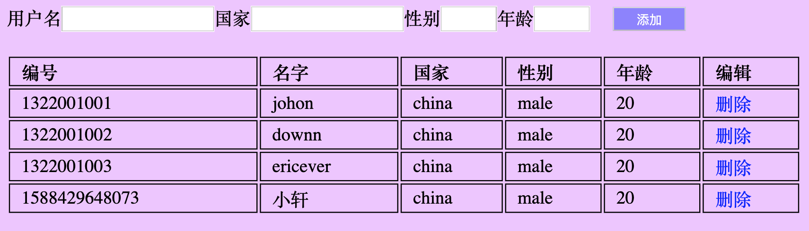
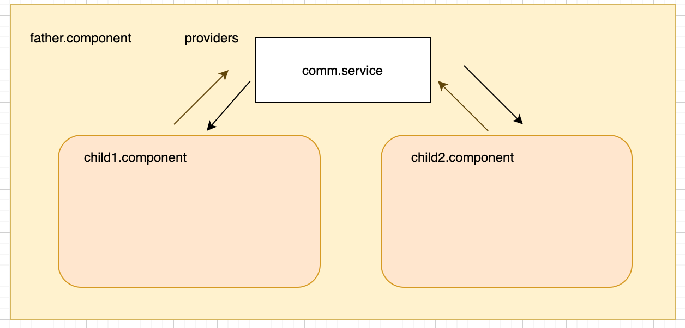
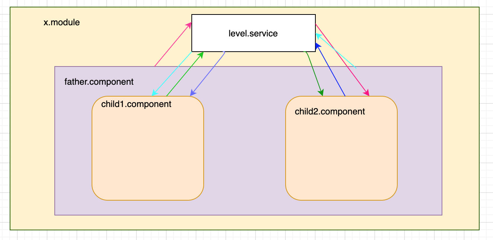
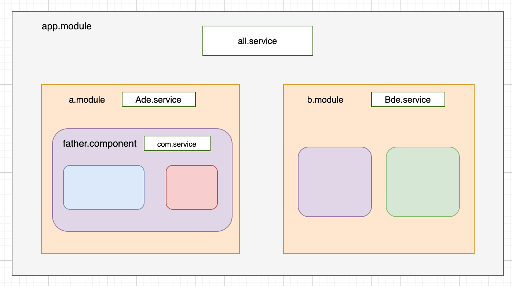
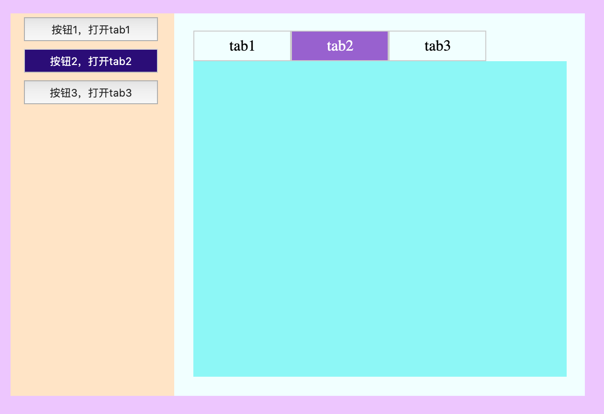

# angular tutorial  / angular 教程

## 5，service

>  服务是程序中处理某个特殊业务的地方，前端的service聚焦于处理某个功能点：提供帮助，过滤，格式化，简化操作等能力。

service在angular中没有特殊的decorator修饰。

#### 1 封装一个简化版的console.log提供信息输出、打印功能的service

log.service.ts

    export default class Log{

        constructor(){        
        }

        format(msg:string){
            console.log(msg);
        }
    }

使用： 通过组件，指令等的构造函数注入，通过providers提供实例化能力

    @Component({
        selector: 'app-body',
        templateUrl: './body.component.html',
        styleUrls: ['./body.component.css'],
        providers:[Log] //声明并实例化相关服务
    })
    export class BodyComponent implements OnInit {

        constructor(private log:Log) {//这里注入，获得的是一个log实例， 这个实例是通过上面的providers 提供的能力得到的
        } 
        ngOnInit() {
            this.log.format("ngOninit 启动了");
        }

    }

-----

#### 2，假设我们要创作这样一个页面(form.componen.ts) 

在这个页面上我们直接把复杂的dom结构都直接写在了(没有分成几个子组件去写)

form.component.html 

    

        <form class="form-inline">
            <label>用户名<input type="text" class="form-control" name="id" [(ngModel)]="user.name"></label>
            <label class="sr-only">国家</label>
            <input type="text" class="form-control " id="nation" name="nation" [(ngModel)]="user.nation">
            <label class="sr-only" >性别</label>
            <input type="text" class="form-control " id="gender" name="gender" [(ngModel)]="user.gender">
            <label class="sr-only">年龄</label>
            <input type="text" class="form-control" id="age" name="age" [(ngModel)]="user.age">
            <button type="submit" class="btn btn-primary" (click)="doAdd()">添加</button>
        </form>
        <table class="table table-bordered">
            <thead>
            <tr>
                <th scope="col">编号</th>
                <th scope="col">名字</th>
                <th scope="col">国家</th>
                <th scope="col">性别</th>
                <th scope="col">年龄</th>
                <th scope="col">编辑</th>
            </tr>
            </thead>
            <tbody>
            <tr *ngFor="let item of userList">
                <td>{{item.id}}</td>
                <td>{{item.name}}</td>
                <td>{{item.nation}}</td>
                <td>{{item.gender}}</td>
                <td>{{item.age}}</td>
                <td class="remove" (click)="remove(item.id)">删除</td>
            </tr>
            </tbody>
        </table>
    

那我们可以直接在 form.component.ts 里面定义数据结构，进行存储，删除等操作。

我们换个思路，

（1）把数据（业务）层面的操作封装到一个service里面进行集中处理。

user.service.ts

    interface Users{
        id:string;
        name:string;
        nation:string;
        gender:string;
        age:string;
    }
    export default class UserService {
        users:{id:string,name:string,nation:string,gender:string,age:string}[] = [
            {id:"1322001001",name:"johon",nation:"china",gender:"male",age:"20"},
            {id:"1322001002",name:"downn",nation:"china",gender:"male",age:"20"},
            {id:"1322001003",name:"ericever",nation:"china",gender:"male",age:"20"}
        ]
        constructor(){}
        //添加一个新用户
        addUser(newone:Users){
            this.users.push(newone);
        }
        //删除一个老用户
        remove(id:string) {
            this.users = this.users.filter((user:Users)=>{
                return id!== user.id;
            });
        }

    }

(2) 在form.compoent.ts 引入并实例化这个service进行处理

    import { Component, OnInit } from '@angular/core';
    import UserService from '../services/user.service';
    interface Users{
        id:string;
        name:string;
        nation:string;
        gender:string;
        age:string;
    }
    @Component({
        selector: 'app-form',
        templateUrl: './form.component.html',
        styleUrls: ['./form.component.css'],
        providers:[UserService]//申明并实例化， 在component实例化的service 只能被当前component和他的孩子共享同一个实例
    })
    export class FormComponent implements OnInit {
        user:Users = {id:"",name:"",nation:"china",gender:"male",age:"20"};
        userList:Users[] = [];
        constructor(private userService:UserService) {}

        ngOnInit() {}

        ngDoCheck(){
            this.userList = this.userService.users;
        }

        doAdd(){
            if(this.user.name) {
                this.user.id = Date.now().toString();
                this.user.nation = this.user.nation||"china";
                this.user.gender = this.user.gender||"male";
                this.userService.addUser(this.user);//调用service的方法进行处理
                this.user = {id:"",name:"",nation:"",gender:"",age:""};//重置
            }else{
                alert("请填写姓名");
            }
        }

        remove(id:string){
            this.userService.remove(id);//调用service的方法进行处理
        }

    }

----

#### 3，把上图的例子复杂化；添加部分单独写一个组件add-user，列表部分单独写一个组件user-list，这两个组件组合放到一个叫form.component的组件页面上

在html上的表现如下：

        

            <add-user></add-user>
            <user-list></user-list>
        

此时，如果我们想达到和之前2里面一样的效果，service的层级需要发生变化。

**注入器的层次结构**

（1）component级别的注入器，通过component/directive 的装饰器提供的providers：[] 注入并实例化

form.component.ts

        @Component({
            selector: 'app-form',
            templateUrl: './form.component.html',
            styleUrls: ['./form.component.css'],
            providers:[UserService] //注入并实例化
        })

只对当前的component和他的子component(如果有的话)共享同一个UserSerivce的实例（同理可以用于，同级别的子component直接的消息通信或者父子之间）

添加组件，adduser.component.ts（作为form.component的子component）

    import { Component, OnInit } from '@angular/core';
    import UserService from '../services/user.service';
    interface Users{
        id:string;
        name:string;
        nation:string;
        gender:string;
        age:string;
    }
    @Component({
        selector: 'add-user',
        templateUrl: './adduser.component.html',
        styleUrls: ['./adduser.component.css']  //不必在此进行service的注入
    })
    export class AdduserComponent implements OnInit {
        user:Users = {id:"",name:"",nation:"china",gender:"male",age:"20"};
        constructor(private userService:UserService) { //直接引用

        }

        ngOnInit() {
        }
        
        doAdd(){
            if(this.user.name) {
                this.user.id = Date.now().toString();
                this.user.nation = this.user.nation||"china";
                this.user.gender = this.user.gender||"male";
                this.userService.addUser(this.user);//直接使用
                this.user = {id:"",name:"",nation:"",gender:"",age:""};
            }else{
                alert("请填写姓名");
            }
        }

}

列表组件 userlist.component.ts

    import { Component, OnInit, Input } from '@angular/core';
    import UserService from '../services/user.service';

    interface Users{
        id:string;
        name:string;
        nation:string;
        gender:string;
        age:string;
    }

    @Component({
        selector: 'user-list',
        templateUrl: './userlist.component.html',
        styleUrls: ['./userlist.component.css']
    })
    export class UserlistComponent implements OnInit {

        userlist:Users[] = [];

        constructor(private userService:UserService) { }

        ngOnInit() {
        }

        ngDoCheck(){
            this.userlist = this.userService.users;
        }

        remove(id:string){
            this.userService.remove(id);
        }

    }

以上两个子组件共同放到 form.component.ts 上展现为和2一致的结果，但是这两个组件都没有引入service， form.component.ts引入并实例化的service

(2)模块级的注入(非app.module)， 通过module提供的providers:[] 声明并实例化。

对当前模块内所有的component,directive共享同一个service实例

(3)应用级的注入,通过app.module提供的providers:[]声明并实例化。

因为app.module是所有应用的入口，因此通过app.module注入的service对所有的子module，component，directive都共享同一个实例

#### service中注入service

假设我们定义了hello.service 和 log.service

angular6 之后，直接使用@Injectable()

    import { Injectable } from '@angular/core';
    import Log from './log.service';

    @Injectable({
        providedIn: 'root'
    })
    export class HelloService {

        constructor(private logService:Log) {

            this.logService.format("hello world from log Service");

        }
    }

**不用再app.module的providers:[]里面进行声明**    

当然以上的方式也等价于老的方式

1 先在app.module的providers里面进行声明

    ......
      imports: [
        BrowserModule,
        FormsModule
    ],
    providers: [
        HelloService,
        Log
    ],
    bootstrap: [AppComponent]
    })
    export class AppModule { }

2 在Hello.service.ts添加元数据并注入

    @Injectable()
    export class HelloService {

        constructor(private logService:Log) {

            this.logService.format("hello world from log Service");

        }
    }

#### 技巧：通过在service中定义EventEmitter 实现组件之间的直接交互

举例：你想制作一个下面所示的页面，左边是三个按钮(treemenu.component)和右侧内容区域(contentpart.cponent)

(1) 点击左边的按钮，相应按钮变亮，随之右侧的内容区域也选择相应的tab进行显示

(2) 点击右侧的tab，相应的tab点亮，随之左侧的按钮也显示对应的激活状态

如何实现两个组件之间的交互呢，关键就是在共享的service内部定义一个 EventEmitter，然后通过这个属性的emit和subscribe来实现消息通信

tab.service.ts

    import { EventEmitter } from '@angular/core';
    export class TabService {
        activeEvent:EventEmitter<any> = new EventEmitter();
        constructor() { }
    }

在 module里面providers:[],这样的话，所以属于这个module的组件，指令都可以共享这个service的实例了

    @NgModule({
        declarations: [
            AppComponent
        ],
        imports: [
            BrowserModule,
            FormsModule
        ],
        providers: [
            TabService
        ]
    })

treemenu.component.ts

    @Component({
        selector: 'app-treemenu',
        templateUrl: './treemenu.component.html',
        styleUrls: ['./treemenu.component.css']
    })
    export class TreemenuComponent implements OnInit {
        activeButton:number = 1;
        constructor(private tabService:TabService) {

        }
        ngOnInit() {
            //监听来自tab切换时发出的事件，并根据数据切换当前组件的button
            this.tabService.activeEvent.subscribe((num)=>{
                this.activeButton = num;
            } );
        }

        active(num:number){
            this.activeButton= num;
            this.tabService.activeEvent.emit(num);//点击按钮时通过service实例的某个属性发出事件
        }

    }

contentpart.component.ts

    @Component({
        selector: 'app-contentpart',
        templateUrl: './contentpart.component.html',
        styleUrls: ['./contentpart.component.css']
    })
    export class ContentpartComponent implements OnInit {
        activeTab:number = 1;
        constructor(private tabService:TabService) { 
            
        }

        ngOnInit() {
            //监听来自左侧按钮点击传来的事件，并根据消息切换tab
            this.tabService.activeEvent.subscribe( (num)=>{
                this.activeTab = num;
            });
        }

        active(num:number) {
            this.activeTab = num;
            this.tabService.activeEvent.emit(num);//点击tab时发出事件
        }

    }