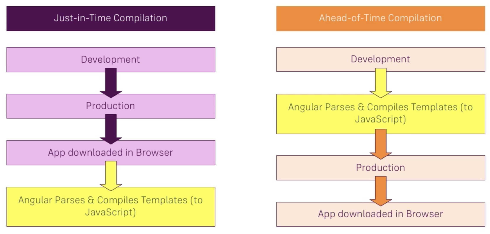

# angular tutorial  / angular 教程

## 8，模块

模块是angular 组件component，指令directive，管道pipe生存的最小单元

#### 创建一模块

    ng g m <module_name>

或者手动创建

（1） 定义一个class  （2）@NgModule装饰器

    import { NgModule } from '@angular/core';
    import { CommonModule } from '@angular/common';
    import { LanguageComponent } from './language/language.component';
    import { NationsComponent } from './nations/nations.component';
    import { ChinaRoutingModule } from './china-routing.module';
    import { ChinaComponent } from './china.component';

    @NgModule({
        declarations: [
            LanguageComponent,
            NationsComponent,
            ChinaComponent
            ],
        imports: [
            CommonModule,
            ChinaRoutingModule
        ]
    })
    export class ChinaModule { }

注意：编写的路由文件ChinaRoutingModule，只需要在这里引入即可。 根module引入这个chinaModule后就会合并子module的路由。

#### featured module 特性模块

当你需要把多个业务分散到各个子模块中，而不是大统一的放到app.module中时，就需要一个特性模块。

（1） 写一个module(如上) （2）编写一个路由module支配这个子module里面的组件展示

    @NgModule({
    declarations: [
        DoorComponent, 
        RenComponent],
    imports: [
        CommonModule,  //引入这个module 支持各种内置的ngIf, pipe 。。。。
        HelloRoutingModule
    ]
    })
    export class HelloModule { }

----

    const routes:Routes = [
        {
            path:"",
            redirectTo:"door"
        },
        {
            path:"door",
            component:DoorComponent
        },
        {
            path:"ren",
            component:RenComponent
        }
    ];

    @NgModule({
        imports:[
            RouterModule.forChild(routes)
        ],
        exports:[
            RouterModule
        ]
    })
    export class HelloRoutingModule {}  

#### shared module
 
当需要把一些工具类的函数，方法，指令共享时(多个模块，多个组件复用)，就需要有一个package把这些东西收纳起来。

shared module 和普通module定义上没区别，但是需要把提供的公共能力exports出来，然后在需要使用的module中引入即可。无需再次声明declarations。

    @NgModule({
    declarations: [
        OrderPipe,
        KitchenComponent, 
        ShowDirective
    ],
    imports: [
        CommonModule
    ],
    exports:[//导出提供的能力，指令，pipe，component
        OrderPipe, 
        KitchenComponent, 
        ShowDirective    
    ]
    })
    export class SharedModule { }

#### lazyload module

当我们把相应的业务分到不同的子module的时候，我们希望在需要的时候再加载，这就需要lazyload

angular8 之后，不使用字符串形式了，改用import

    {
        path:"hello",
        loadChildren:()=>import('./hello/hello.module').then( (mod:any)=>{ return mod.HelloModule } )
    },   
    {
        path:"demos",
        loadChildren:()=>import('./demos/demos.module').then( (mod:any)=>{ return mod.DemosModule } )
    },  

#### 特别注意： 这里是有顺序的

(1)其他引入的特性module，shared module 一定要在AppRoutingModule之前

    imports: [
        BrowserModule,
        FormsModule,
        ChinaModule,
        AppRoutingModule
    ],

(2) 在app.module 里面已经providers的service 无需再子module ，lazyload module中再次providers

app.module provides注入的是整个应用级的

#### 使用canLoad 保护模块载入的合法性

    { 
        path: 'recipes', 
        loadChildren: import('./recipes/recipes.module').then( (mod)=>{ return mod.RecipesModule }), 
        canLoad: [AuthGuard]
    } 

    注意: AuthGuard要实现 CanLoad接口

-----

core module

(1) app module只放 app component

(2) 唯一被app component直接使用的组件，指令，应该放到core module 里面

(3) core module 内的组件才是展示各个feature module内特性的入口

----

IOT vs AOT

必须说明下：把ts转成js这一步不是angular框架提供的，而是cli + tsconfig.js处理的

angular框架本身需要做的是把指令+component+pipe+service....构成的模板转成js，类似angularjs 里面的compilition

angular 提供了两种类型的编译过程 JIT and AOT 

我们默认的 开发-->ng serve 调试 走的是JIT 

#### 使用AOT 

    ng build --prod --aot

