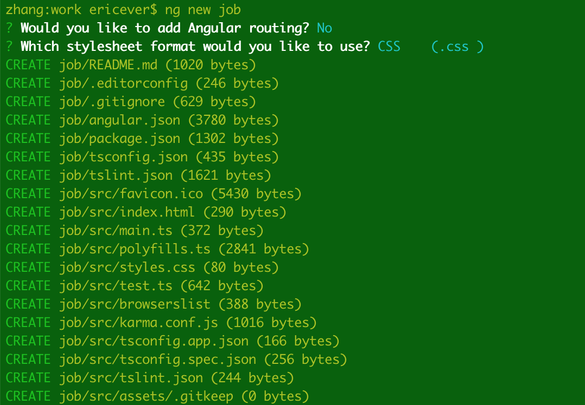
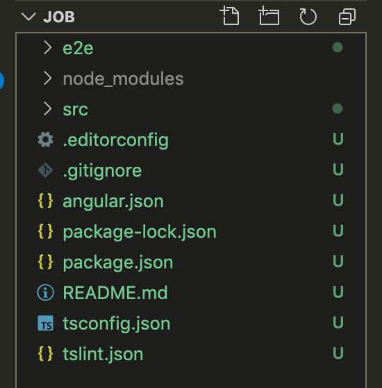
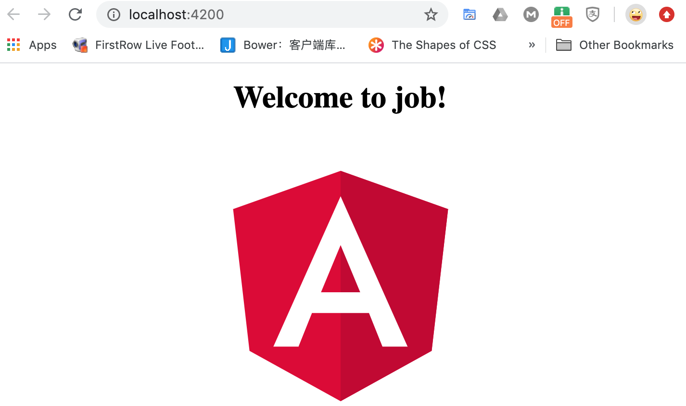
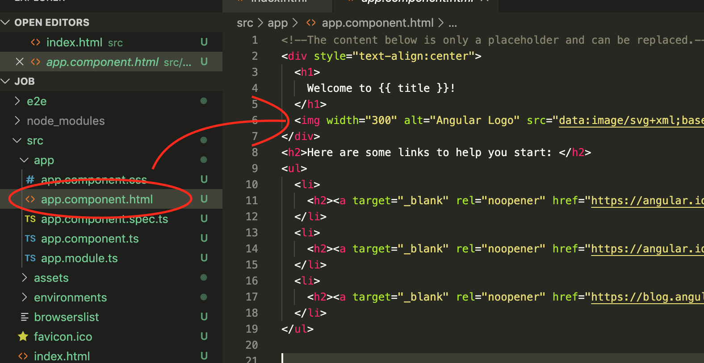
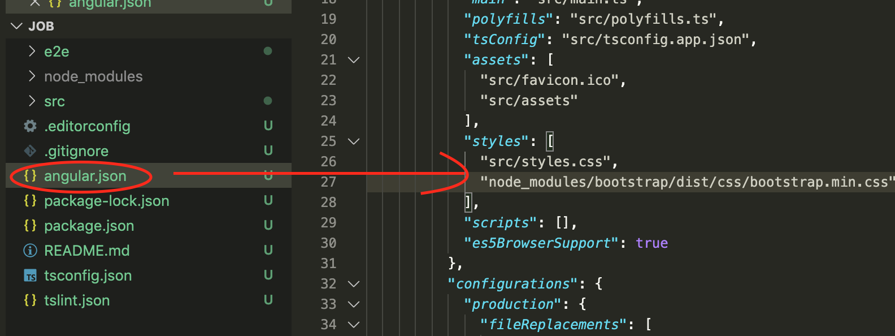

# angular tutorial  / angular 教程

## 1，快速入门

(1) 环境配置

> 请确保以下基本环境在记得机子上安装并正常运行

    nodejs 10.0.0+ 
    npm    6+
    git    2.26+
    vscode 1.0+

（2）angular脚手架

    npm install -g @angular/cli

> 安装完毕后通过  ng --version 判断是否安装成功

 (3)初始化一个项目

 > 生成项目骨架，安装好配置

    ng new <project_name>

: 举例

    ng new job

然后用编辑器打开,看到如下结果

(4) 启动项目，查看页面

> ng new job 创建一个项目，并附带一个 欢迎的初始界面。，你可以通过启动命令 ng serve 启动一个静态服务器，查看页面

    ng serve

在浏览器打开http://localhost:4200/ 查看页面， 默认页面如下

(5) 修改欢迎界面

> 打开项目的src/app/app.component.html,修改里面内容

修改完成之后，保存； 页面会自动刷新。

(6) 添加bootstrap支持

首先安装

        npm install bootstrap --save

添加angular.json

>编辑 项目根目录下的angular.json文件

然后你就可以直接在项目中应用bootstrap的各种class 和字体了

**注意,任何对angular.json的修改都需要重启 ng serve 才能生效**

(7) 添加jquery支持

首先安装

    npm install jquery --save

在ts中引入使用

    